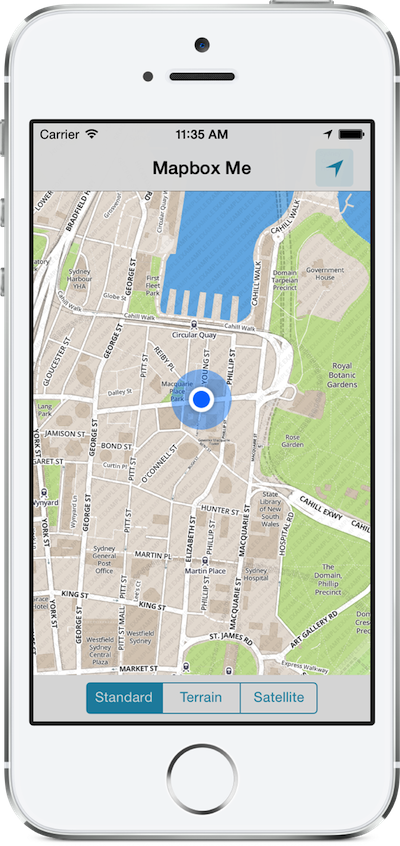

# Mapbox Me

Small reference implementation of native iPhone Mapbox maps. Displays user's location & heading on Mapbox Streets somewhat like Maps.app.

Makes use of the built-in user location services capabilities of the [Mapbox iOS SDK](https://github.com/mapbox/mapbox-ios-sdk).

